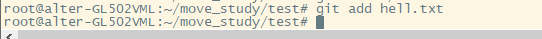

# IDE笔记
## 安装VScode:
· url:https://code.visualstudio.com/

- 因为我这边使用的系统是Linux所以是.deb或者.rpm随便下载哪个都可以。

- 下载完成后使用命令dpkg -i 加安装包名称进行安装。

这样就安装成功了。

- 安装完成后可以在application中找到。

- 点击打开出现了报错，先不要急。

- 我们通过命令行启动，发现原因是因为尝试使用超级用户，可以添加"--no-sandbox"

- 使用命令code --no-sandbox重新启动

这样就启动成功了。

## 插件安装市场
- 插件安装市场位于最左侧的菜单栏中，用于安装开发环境中所用到的一些拓展，如语法提示之类的。

点击后会弹出一个小的页面，在小页面的上方有一个搜索框，可以快速查找所需要的插件，installer中会展示我们已经安装过的插件，点击插件后的install可安装对应插件。

## 关于其他区域划分可参考下图

## 在vscode的欢迎页中有一些引导配置，比如我们可以选择自己喜欢的主题，其他的有兴趣可以自己研究一下。

## 文件菜单介绍
文件菜单用于新建文件或者快速打开我们本地的项目，在部分文件菜单的子项右边有快捷键的说明，记住这些快捷键能够提高开发效率。

## 查看菜单介绍
查看菜单用于设置开发功能区的显示与隐藏，当我们意外关闭某个功能区时可以在此处重新打开。

- 以上两个菜单是我们开发时最常用的，关于其他菜单用的不多，点一下看看了解就行了。

## VScode 交互演练场
交互演练场中我们可以学到一些快速操作的技巧，入口位于Help>Editor Playground

### 技巧1：快速选中

- 摁住Alt+shift 移动光标可以快速选中任意矩形范围内容。

- 摁住Alt+shift+上下可以拓展光标长度同时修改多行内容

- 选中一个单词后，使用ctrl+shift+L可以快速选中全文中出现的这个单词

### 技巧2：智能提示
- 在写代码时可以使用crtl+空格键快速获取提示信息。

### 技巧3：行操作
- 使用alt+上下键可快速移动光标行到上下位置。

### 技巧4：重命名
- 选中类名，使用F2，可根据上下文快速对代码中所有关联内容进行重命名。

### 技巧5：快速排版
- 使用ctrl+shift+i 可以快速对代码进行格式化。

### 技巧6: 快速折叠
- 使用ctrl+shift+[可以快速折叠代码，使用ctrl+shift+]可快速展开。

- 除了上面讲到的技巧，在练习场还有很多其他技巧，有时间可以自由探索。

# VSCode基础配置

## 字体配置
- 字体过小开发时会加重我们的负担，此时我们需要对字体大小进行配置，打开设置（ctrl+,）

- 在这个页面，我们能看到font Size、Font Famil等内容，根据需要可自行配置，此处我们修改字体大小为20.

- 修改后

## 配置重启后打开空白项目
- 设置中搜索restore 设置为None即可

## 配置重启后什么都不打开
- 设置中搜索startup 设置为None即可

## 配置退出时提示是否保存
- 设置中搜索hot exit 设置为off

## 设置打开文件只预览，不修改
- 设置中搜索preview 勾选enable preview选框

## 光标设置
- 设置中搜索cursor可以对光标进行自定义配置

- 到这里我们的VSCode基本上就够用了下面让我们进入git学习。

# git学习

## 安装
- 在linux 中我们可以直接使用命令apt install git -y 安装git程序。

## 设置用户签名
- 设置用户签名用于提交代码时表明身份
git config --global user.name "Al17er"

git config --gloabl user.email "aaa@qq.com"

## 初始化本地库
- 初始化本地库使git获取项目管理权。
git init

## 查看本地库状态
git status

- 第一行表明当前在master分支
- 第二行表明当前没有提交记录
- 第三行表明当前没有要提交的内容

- 目录下新增文件后查看状态发现状态多了提交文件

## 添加暂存区
git add

- 再次查看状态

- 此时文件存储在暂存区还是可以删除的，通过命令git rm --cached hello.txt,这个命令只会删除暂存区不会删除本地文件。

## 提交文件
git commit -m "日志信息" 文件名

- 再次查看日志

## 查看日志
git reflog //精简日志
git log  //详细日志

## 修改文件

- 添加文件至暂存区

- 提交文件

## 穿梭版本
git reset --hard 版本号

## 分支概念
- 在版本控制中，为了同时推进多个任务进行，如在程序开发时，为了同时保证用户使用，和程序开发进程，就可以创建一个生产分支和1个开发分支。

## 查看分支
git branch -v

## 创建分支
git branch 分支名

## 切换分支
git checkout 分支名

## 分支合并
git merge 分支名

## 冲突合并
当两个分支中存在同一文件但不统一意见时就会冲突。
此时需要手动处理冲突文件，并重新添加提交。

## 创建远程库
- 登录github>>your repository>>new

- 点击crete创建

## 创建远程库别名
git remote add test git@github.com:Al17er/test.git
git -v 

## 推送代码
git push 别名 分支

推送成功

## 拉取远程库到本地
git pull 别名 分支

## 克隆远程代码
git clone 地址

## 修改后重新push

git add ./
git commit "remote edit"
git push

## fork
- fork 用与把别人的代码复制一份到自己的仓库里。

## pull request
- 当自己仓库代码修改完成后，提交请求可以把修改内容推送到原作者仓库。

## 配置ssh免密登录
ssh-keygen -t rsa -C "邮箱地址"
查看~/.ssh/id_rsa.pub文件内容
最后在github上添加公钥

ssh -T git@github.com

- 出现这个内容代表配置成功！