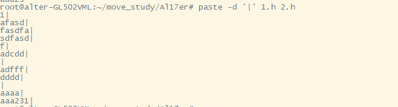
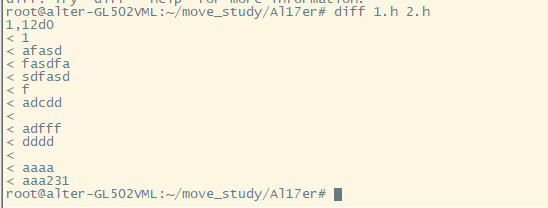
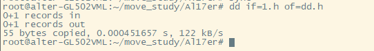
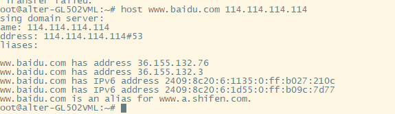
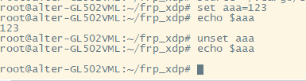

## man
- 用法：man + 命令
- 用途：当我们不知道一个命令的使用方法可以使用man获取该命令的使用说明书。
- 案例：man rm

## info
- 用法：info + 命令
- 用途: 获取命令帮助信息
- 案例：info rm

## whatis
- 用法：whatis + 命令
- 用途: 获取命令帮助信息(精简版)
- 案例：whatis man

## touch 
- 用法: touch + 文件名
- 用途: 创建文件
- 案例: touch Al17er

## mkdir
- 用法: mkdir + 目录名
- 用途: 创建文件夹
- 案例: mkdir Al17er

## rm
- 用法: rm + 文件名
- 用途: 删除文件或目录
- 案例: rm -rf Al17er

## rmdir
- 用法: rmdir + 目录名
- 用途: 删除空目录
- 案例: rmdir Al17er

## mv
- 用法: mv 源文件 重命名后文件
- 用途: 重命名文件或文件夹
- 案例: mv test Al17er

## cp
- 用法: cp 源文件 目的文件
- 用途: 复制文件或文件夹
- 案例: cp -r Al17er test

## cd 
- 用法: cd 目录路径
- 用途: 改变路径
- 案例: cd Al17er

## pwd 
- 用法: pwd
- 用途: 查看当前所在路径
- 案例: pwd

## ls
- 用法: ls 目录路径
- 用途: 列出目录文件
- 案例: ls

## tree
- 用法: tree
- 用途: 查看目录结构
- 案例: tree /opt

## stat
- 用法: stat 文件名
- 用途: 查看当前文件属性
- 案例: stat test

## rename
- 用法: rename 's/old/new/' files
- 用途: 批量重命名文件
- 案例: rename 's/h/a/' *.h

## basename
- 用法: basename /path/to/somefile.txt
- 用途: 从给定的文件名或路径中提取出基本文件名
- 案例: basename 1.h .h

## dirname
- 用法: dirname /root/move
- 用途: 提取命令中的目录部分
- 案例: dirname /root/move

## file
- 用法: file 文件名
- 用途: 判断文件类型
- 案例: file /dev/sda
 

## md5sum 
- 用法: md5sum 文件名
- 用途: 计算文件md5值
- 案例: md5sum 1.h

## find 
- 用法: find 
- 用途: 查找文件
- 案例: find /root/ -name 1.h

## which
- 用法: which + 命令
- 用途: 搜索命令所在路径
- 案例: which ls

## whereis
- 用法: whereis + 命令
- 用途: 定位命令所在文件
- 案例: whereis ls

## locat 
- 用法:locat string
- 用途:快速查找包含指定字符的文件
- 案例:locat 1.h

## chown 
- 用法: chown 用户:组 文件
- 用途: 改变文件或目录的所有者和组。
- 案例: chown root:root 1.h

## chgrp
- 用法: chgrp 组 文件
- 用途: 改变文件或目录的所属组。
- 案例: chgrp alter 1.h

## chmod
- 用法: chmod 模式 文件
- 用途: 改变文件或目录的访问权限。
- 案例: chmod 755 1.h

## grep
- 用法: grep string
- 用途: 在文件中搜索与给定模式匹配的行，并将这些行打印到标准输出。
- 案例: ls -l /etc |grep ssh

## egrep
- 用法: egrep '正则' string
- 用途: grep 的一个变体，它默认使用扩展正则表达式
- 案例: ls -l /etc |egrep ssh

## cat
- 用法: cat 文件名
- 用途: 查看文件内容
- 案例: cat 1.h

## more
- 用法: more 文件
- 用途: 按页显示文本内容
- 案例: more 1.h

## less
- 用法: less 文件
- 用途: 分页展示文本内容
- 案例: less 1.h

## head
- 用法: head 文件名
- 用途: 显示文件前几行
- 案例: head -n 5 1.h

## tail 
- 用法: tail 文件名
- 用途: 显示文件后几行
- 案例: tail -n 5 1.h

## tac
- 用法: tac 文件名
- 用途: 从后往前输出文本内容
- 案例: tac 1.h

## nl
- 用法: nl 文件名
- 用途: 统计文本行数
- 案例: nl 1.h

## wc
- 用法: wc 文件名
- 用途: 统计文件字数
- 案例: wc 1.h

## splt
- 用法: split 输入文件 输出文件
- 用途: 将一个大文件分割成多个小文件。可以按行数、字节数或大小来分割文件。
- 案例: split -l 3 1.h part1_

## cut
- 用法: cut 文件名
- 用途: 从文件的每一行中提取部分内容。可以基于字符、字段或字节来选择要提取的部分。
- 案例: cut -c1-5 1.h

## paste
- 用法: paste 文件1 文件2
- 用途: 将多个文件的内容按行合并，并使用制表符或其他指定的分隔符进行分隔。
- 案例: paste -d '|' 1.h 2.h

## groupadd
- 用法: groupadd 组名称
- 用途: 添加用户组
- 案例: groupadd test

## groupdel
- 用法: groupdel 组名称
- 用途: 删除用户组
- 案例: groupdel test

## sort
- 用法: sort 文件名
- 用途: 对文本文件中的行进行排序。默认升序。
- 案例: sort 1.h

## unip
- 用法: uniq 文件名
- 用途: 去重复
- 案例: uniq 1.h

## diff 
- 用法: diff 文件1 文件2
- 用途: 比较2个文件差异
- 案例: diff 1.h 2.h

## patch
- 用法: patch 原文件 < 补丁文件
- 用途: 根据 diff 生成的补丁文件对文件进行修改。patch 可以应用或回滚文件的变化。
- 案例: 这个命令用不到，有请下一位

## join
- 用法: join 文件1 文件2
- 用途: 将两个文件基于共同字段（通常是第一列）进行连接，并输出匹配的行。
- 案例: join 1.h 2.h

## tr 
- 用法: tr 字符集1 字符集2
- 用途: 用于字符的转换或删除。tr 可以将一组字符转换为另一组字符，或者删除某些字符。
- 案例: tr '[:lower:]' '[:upper:]' < 1.h

## sed
- 用法: sed '正则' 文件
- 用途: 用于对输入流（文件或管道）进行基本的文本转换。
- 案例: sed '1,5d' 1.h

## awk
- 用法: awk '正则' 文件名
- 用途: 处理文本文件中的数据，进行复杂的模式匹配、字段操作、数学运算等。
- 案例: awk -F, '{print $1}' 1.h

## usermod
- 用法: usermod 用户名
- 用途: 用于修改现有用户的属性。可以更改用户的登录名、主目录、默认 shell、用户组等。
- 案例: usermod -l haha heihei

## groups
- 用法: groups 用户名
- 用途: 显示一个或多个用户所属的所有组
- 案例: groups root

## awk
- 用法: awk '正则' 文件名
- 用途: 处理文本文件中的数据，进行复杂的模式匹配、字段操作、数学运算等。
- 案例: awk '{print $1}' 1.h

## du
- 用法: du 文件|目录
- 用途: 显示文件和目录的磁盘使用情况。
- 案例: du -h 1.h

## df
- 用法: df 文件系统
- 用途: 显示文件系统的磁盘空间使用情况。
- 案例: df -h /root

## sync
- 用法: sync
- 用途: 将内存中的所有未写入数据（脏页）同步到磁盘。
- 案例: sync

## mount
- 用法: mount 磁盘 挂载目录
- 用途: 挂载磁盘
- 案例: mount /dev/sda /opt

## umount
- 用法: umount 挂载目录
- 用途: 取消挂载
- 案例: umount /opt

## dd
- 用法: dd
- 用途: 用于从一个文件或设备复制数据到另一个文件或设备。
- 案例: dd if=1.h of=dd.h

## tar
- 用法: tar 压缩包
- 用途: 解压或压缩文件
- 案例: tar -cvf 11.tar 1.h

## zip_unzip
- 用法: zip|unzip 压缩包名
- 用途: 解压或压缩文件
- 案例: unzip 1.zip

## gzip_gunzip
- 用法: gzip|gunzip 压缩包名
- 用途: 解压或压缩文件
- 案例: gzip 1.h

## uname
- 用法: uname 
- 用途: 查看系统信息
- 案例: uname -a

## hostname
- 用法:hostname
- 用途:查看主机名
- 案例: hostname

## dmesg
- 用法: dmesg
- 用途: 显示或控制内核环形缓冲区中的消息。
- 案例: dmesg

## 
- 用法:uptime
- 用途:查看系统资源使用情况
- 案例:uptime

## free
- 用法: free
- 用途: 查看内存使用情况
- 案例: free -m

## ulimit
- 用法: ulimit
- 用途: 用于控制 shell 启动进程可用的系统资源。
- 案例: 这个命令可不敢随便用，有请下一位。

## init
- 用法: init 3|5|6|0
- 用途: 切换系统运行级别
- 案例: 0：关机 3：图形 5:最小化 6:重启

## service
- 用法: service 服务名 指令
- 用途: 操作系统服务运行
- 案例: service frpc status

## vmstat
- 用法: vmstat
- 用途: 显示虚拟内存状态
- 案例: vmstat

## iostat
- 用法: iostat
- 用途: 监视系统输入输出设备和CPU的使用情况命令
- 案例: iostat

## ipcs
- 用法: ipcs
- 用途: 显示进程间通信设备状态命令
- 案例: ipcs

## ipcrm
- 用法: ipcrm
- 用途: 删除指定ipc资源
- 案例: 这个命令可不敢乱删，有请下一位。

## route
- 用法: route
- 用途: 查看路由表
- 案例: route

## ping
- 用法: ping ip
- 用途: 测试icmp
- 案例: ping www.baidu.com

## traceroute
- 用法: traceroute ip
- 用途: 路由追踪，用于网络排错。
- 案例: traceroute www.baidu.com

## ifconfig
- 用法: ifconfig
- 用途: 查看本机网络配置。
- 案例: ifconfig

## ifup
- 用法: ifup 接口
- 用途: 启用网络接口
- 案例: ifup eth0

## ifdown
- 用法: ifdown 接口
- 用途: 关闭网络接口
- 案例: ifdown eth0

## netstat
- 用法: netstat 
- 用途: 查看端口开放情况
- 案例: netstat -ano

## ss
- 用法: ss
- 用途: 显示活动套接字信息命令
- 案例: ss

## telnet
- 用法: telnet ip
- 用途: 远程连接服务器，常用来测试端口开放情况
- 案例: telnet www.baidu.com 80

## ssh
- 用法: ssh 用户名@ip
- 用途: 远程登录服务器
- 案例: ssh root@127.0.0.1:3223

## ftp
- 用法: ftp ip
- 用途: 连接目标ftp服务
- 案例: ftp 127.0.0.1

## sftp
- 用法: sftp ip
- 用途: 加密文件传输
- 案例: 使用crt连接

## lftp
- 用法: lftp ftp://用户名:密码@ftp.xx.com
- 用途: 功能强大的文件传输程序
- 案例: 不常用，了解即可。

## wget
- 用法: wget + url地址
- 用途: 下载文件到本地。
- 案例: wget www.baidu.com

## scp
- 用法: scp 源文件 目标文件
- 用途: 远程拷贝文件
- 案例: 不常用命令。

## curl
- 用法: curl url
- 用途: 向目标地址发起http请求。
- 案例: curl www.baidu.com

## host
- 用法: host 域名
- 用途: 用于执行 DNS 查询的命令行工具。可以用来查询域名.
- 案例: host www.baidu.com 114.114.114.114

## tcpdump
- 用法: tcpdump
- 用途: 抓包网络请求数据包。
- 案例: tcpdump -i wlp2s0

## nc
- 用法: nc 主机 端口
- 用途: 常用于创建 TCP 或 UDP 连接，监听端口，传输文件，进行端口扫描等。
- 案例: nc -l -p 1233

## useradd
- 用法: useradd 用户名
- 用途: 添加用户
- 案例: useradd test

## adduser
- 用法: adder 用户名
- 用途: 创建用户
- 案例: adduser test123

## passwd
- 用法: passwd 用户名
- 用途: 为用户添加或修改密码
- 案例: passwd test

## userdel
- 用法: userdel 用户名
- 用途: 删除用户
- 案例: userdel test

## su
- 用法: su 用户名
- 用途: 切换用户
- 案例: su alter

## sudo
- 用法: sudo 命令
- 用途: 以超级用户权限执行命令
- 案例: sudo whereis ls

## id
- 用法: id
- 用途: 查看当前用户信息
- 案例: id

## whoami
- 用法: whoami
- 用途: 查看当前登录用户
- 案例: whoami

## who
- 用法: who
- 用途: 查看当前在线用户
- 案例: who

## w
- 用法: w
- 用途: 查看当前在线用户
- 案例: w

## last
- 用法: last
- 用途: 显示最近登录用户日志
- 案例: last

## users
- 用法:users
- 用途: 查看当前用户信息
- 案例: users

## top
- 用法: top
- 用途: 查看系统资源占用情况
- 案例: top

## ps
- 用法: ps 
- 用途: 查看当前系统运行进程信息
- 案例: ps -ef

## pstree
- 用法: pstree
- 用途: 以进程树方式显示当前系统运行进程。
- 案例: pstree

## pgrep
- 用法: pgrep 进程名
- 用途: 获取当前进程id
- 案例: pgrep frp

## lsof
- 用法:lsof
- 用途: 列出所有进程打开的文件
- 案例: lsof

## jobs
- 用法:jobs
- 用途:查看后台进程
- 案例:jobs

## bg
- 用法: bg
- 用途: 将前台进程转至后台运行
- 案例: bg

## fg
- 用法: fg
- 用途: 将后台进程转至前台运行
- 案例: fg

## kill
- 用法:kill 进程名
- 用途:关闭进程
- 案例:kill -9 frp

## killall
- 用法: killall 进程名
- 用途: 关闭所有同进程名的进程
- 案例: killall -9 frp

## nice
- 用法: nice 命令
- 用途: 用于启动一个新进程，并为其设置一个不同的调度优先级。
- 案例: nice free

## renice
- 用法: renice 优先级 进程号
- 用途: 用于改变已运行进程的调度优先级。
- 案例: renice 5 -p 2981

## nohup
- 用法: nohup 命令
- 用途: 运行命令并挂在后台
- 案例: nohup ls

## apt
- 用法: apt 操作 报包
- 用途: 包管理器
- 案例: apt install vim

## apt-get 
- 用法: apt-get 操作 包名
- 用途: 包管理器，apt的全命令
- 案例: apt-get install vim

## export
- 用法:export 变量名
- 用途:用于设置环境变量
- 案例:export aaa=123

## source
- 用法:source 文件
- 用途:立即加载文件变量
- 案例:source ~/.cargo/env

## set|unset
- 用法:set|unset 变量名=123
- 用途:设置或取消环境变量
- 案例:set aaa=123 | unset aaa

## echo
- 用法:echo string
- 用途:输出文本
- 案例:echo "123"

## printf
- 用法: printf string
- 用途: 不接换行符打印文本
- 案例: printf aaaa

## clear
- 用法: clear
- 用途: 清屏
- 案例: clear

## history
- 用法: history
- 用途: 查看历史记录
- 案例: history

## login_logout
- 用法:login_logout
- 用途:登录|登出

## exit
- 用法: exit
- 用途: 退出并关闭终端

## xargs
- 用法: xargs 命令
- 用途: 强大的命令行工具，用于从标准输入构建和执行命令。
- 案例: ls | xargs echo 

## exec
- 用法: exec 命令
- 用途: 执行完当前命令后关闭终端
- 案例: exec ls

## alias_unalias
- 用法: alias_unalias 别名="执行操作"
- 用途: 设置别名操作命令
- 案例: alias lp="ls -l"

## type
- 用法: type 命令
- 用途: 用于显示给定命令的类型。它可以告诉你一个命令是内置命令、外部命令（可执行文件）、函数还是别名。
- 案例: type ls

## date
- 用法:date
- 用途:显示时间
- 案例:date

## cal 
- 用法: cal 日期
- 用途: 命令用于显示当前月份的日历或指定月份/年份的日历。
- 案例: ubuntu未找到该命令

## crontab
- 用法:crontab 
- 用途: 设置定时任务
- 案例: crontab -l

## at
- 用法: at 时间
- 用途: 设置一次性计划任务
- 案例: echo "echo Hello, World!" | at now + 1 minutes

## atq
- 用法: atq
- 用途: 列出所有已安排的任务。
- 案例: atq

 
## atrm
- 用法: atrm 任务号
- 用途: 用于删除已安排的 at 任务。
- 案例: atrm 2

## time 
- 用法: time 命令
- 用途: 测量命令执行时间
- 案例: time ls

## watch
- 用法: watch 命令
- 用途: 每隔一段时间执行一次命令
- 案例: watch -n 2 ls

## bc 
- 用法: bc 
- 用途: 任意精度计算器语言。它可以处理非常大的数字，并且支持基本的算术运算、变量定义、条件语句等。
- 案例: echo "2 + 2" | bc

## ln
- 用法: ln 源文件 目的路径
- 用途: 创建软连接
- 案例: ln -s 1.h 9.h

## shutdown
- 用法: shutdown
- 用途: 关机

## halt
- 用法: halt
- 用途: 用于关闭系统。它会停止所有运行中的进程，并将系统置于一个可以安全断电的状态。

## poweroff
- 用法: poweroff
- 用途: 关机

## reboot
- 用法: reboot
- 用途: 重启
